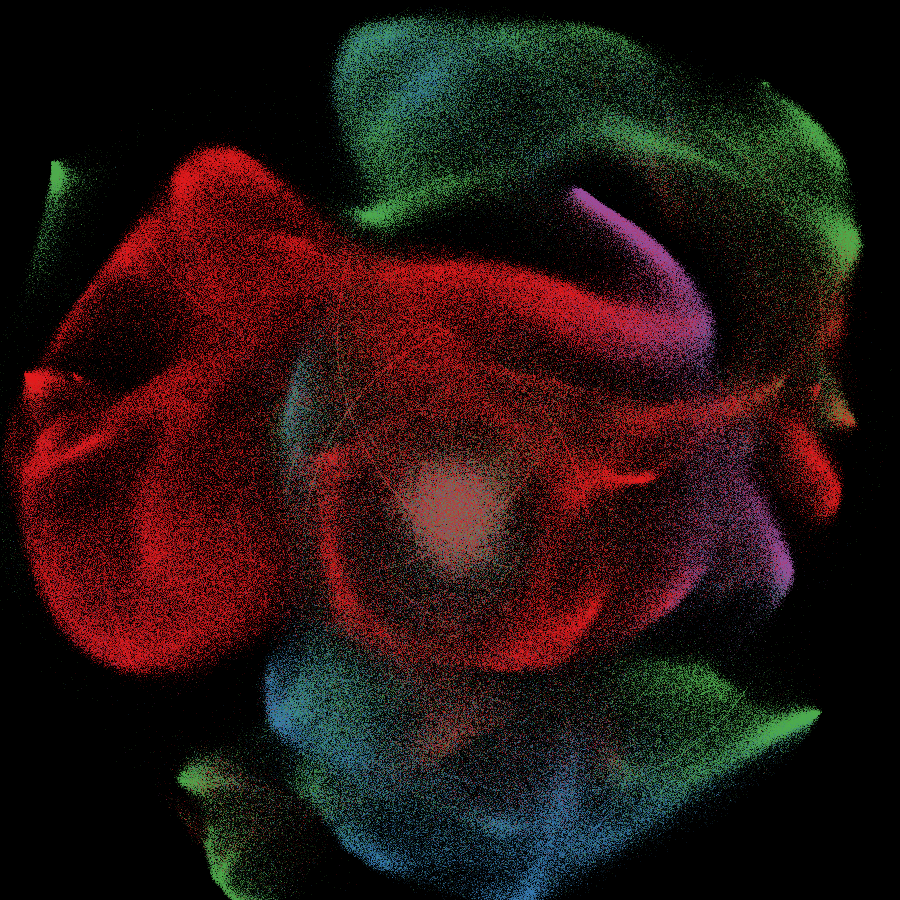
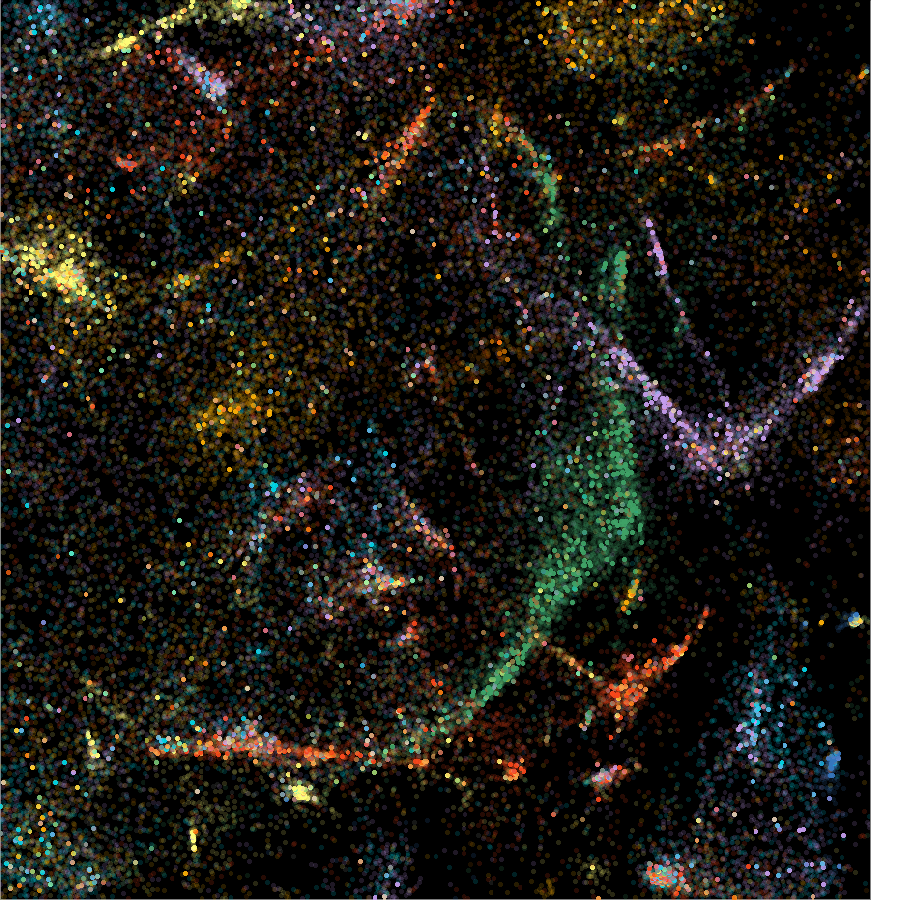

[Datashader](https://datashader.readthedocs.io/en/latest/) is a new Python visualization library I discovered recently that turned out to be really powerful. From their website:

> Datashader is a graphics pipeline system for creating meaningful representations of large datasets quickly and flexibly. Datashader breaks the creation of images into a series of explicit steps that allow computations to be done on intermediate representations. This approach allows accurate and effective visualizations to be produced automatically, and also makes it simple for data scientists to focus on particular data and relationships of interest in a principled way. Using highly optimized rendering routines written in Python but compiled to machine code using Numba, datashader makes it practical to work with extremely large datasets even on standard hardware.

I've been using it for visualizing 2D embeddings of 500k-1M high-dimensional data points, though it can certainly handle far more. Here, for example, is visualization of a [Word2Vec](https://en.wikipedia.org/wiki/Word2vec) model trained on abstracts from one million academic papers from the Web of Science:

 

(Red = Life Sciences & Biomedicine, Blue = Technology, Green = Physical Sciences, Purple = Social Sciences & Humanities)

The embedding was learned with [t-SNE](https://lvdmaaten.github.io/tsne/) and points are colored by top-level WoS subject headings.

Apart from making pretty pictures, the really neat thing here is performance. Datsahder is essentially generating a density plot, and coloring pixels accordingly, but you can actually generate interactive versions of a plot like the one above. These will let you zoom in, and datashader will automatically re-render the image based on the zoom level (see [here](https://anaconda.org/jbednar/census/notebook) for a much better explanation and tutorial).

Just for fun, here is a new embedding of the music data from a [previous post](https://jlorince.github.io/Modeling-musical-artists-2/) (using Word2Vec in a somewhat unconventional way that I hope to discuss later). Here each point is a musical artist (~500k total), and colors correspond to Gracenote genre classifications:

 

And as an example of re-rendering/zooming, here's a detail of the region surround the jazz cluster:

 

