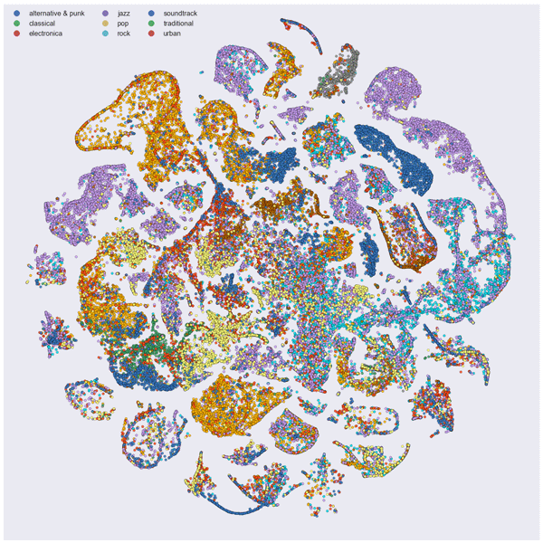

I'm finally settling down into the new post-doc (oh, and I finished my PhD!), and will try to start posting again here.

For a start, here's a new and improved version of the visualization [from the last time I posted](https://jlorince.github.io/Modeling-musical-artists/). The interactive version is pretty resource intensive (note to self: learn how to make interactive graphics at this scale that don't bog down the browser...), so you'll have to settle for this static version.

The difference is that time I've included all 112,312 artists from my Last.fm data [1]. As before, the artist-to-artist distance are determined by latent space modeling (using [LDA](https://en.wikipedia.org/wiki/Latent_Dirichlet_allocation)), while the spatial arragement is achieved by the [t-SNE](https://lvdmaaten.github.io/tsne/) dimensionality reduction technique. The cool thing is that *post-hoc* coloring of points with canoncical genre labels reveals that the structure we observe based on co-listening data nicely aligns with real-world genre clusters.

<!---->

(Hi-res version availble [here](../images/tsne.png))

[1] Technically this isn't all the artists, but rather all the artists with (a) at least 1,000 total listens recorded across all users, and (b) at least 100 unique listeners. This heuristic let us ignore a bunch of garbage data, and kep the LDA models we were running manageable.
